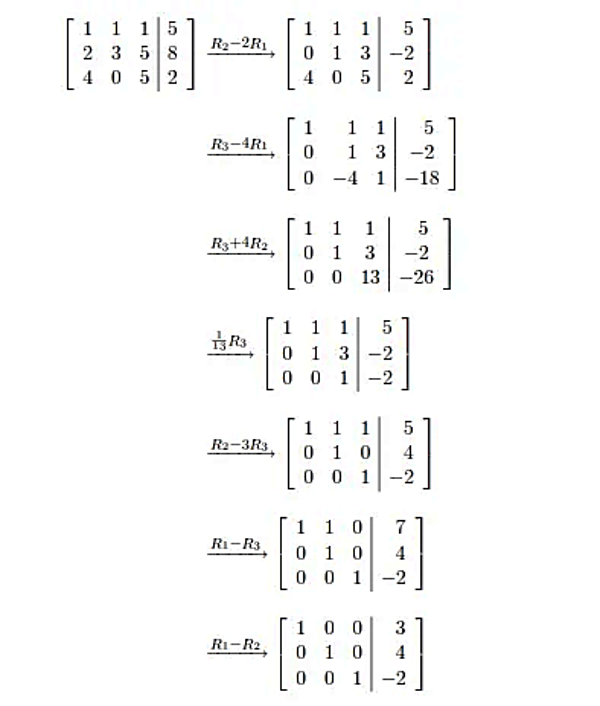

## Finite-Element

### Gauss–Jordan Code

In the file `Subroutine/Gauss-Jordan.f95`, a subroutine has been developed in Fortran to implement the **Gauss–Jordan elimination algorithm**.  
This subroutine utilizes elementary row operations to solve systems of linear equations of the form $A\mathbf{x} = \mathbf{B}$, where $A$ is a square matrix of large dimension.

The algorithm proceeds in two main steps:  
1. First, it reduces the matrix to a **upper triangular form** via forward elimination.  
2. Then, it transforms the result into a **diagonal matrix** through backward elimination.

As a result, the solution vector $\mathbf{x}$ can be obtained directly.

In addition to solving the linear system, the subroutine can also compute:  
- the **determinant**  
- the **rank of the matrix**  
- and the **inverse** of the square matrix.

